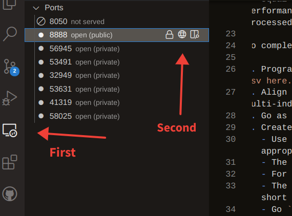

# A Simple Example

## Start the app.

At the command line, type:

```bash
streamlit run app.py
```

A browser tab will open with the app starting up. The file, `app.py` is the core python script to run the app. The other files kept here were to grab elements of the code for the purposes of the `streamlit` app. These other files are ran as one normally might, with `python <scriptname>.py`.

## Jupyter Notebook

A Jupyter notebook server has been automatically spawned when the IDE is launched. You can access it by clicking remote explorer on the left hand side context menu, which will open up the available ports. From there click on the globe icon for port 8888. This will open the server in a tab in your browser. See the screenshot below for the specific icons discussed. The password for the Jupyter server is `bill`.

### Screenshot for Jupyter Notebook Server

